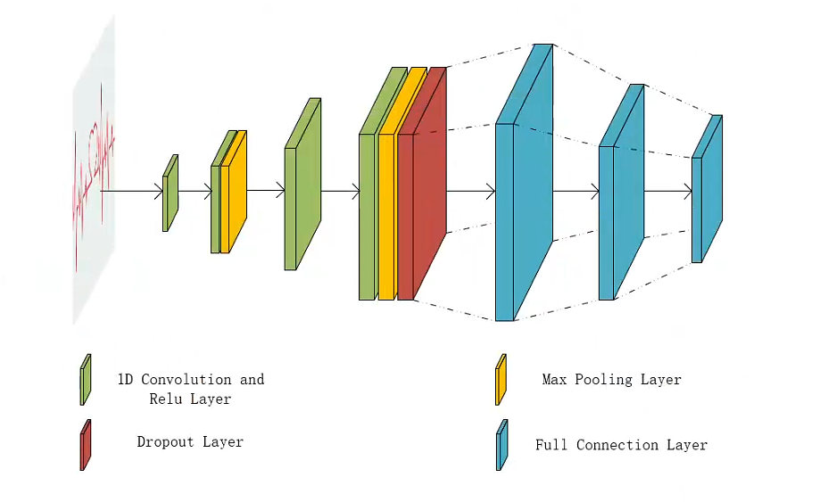
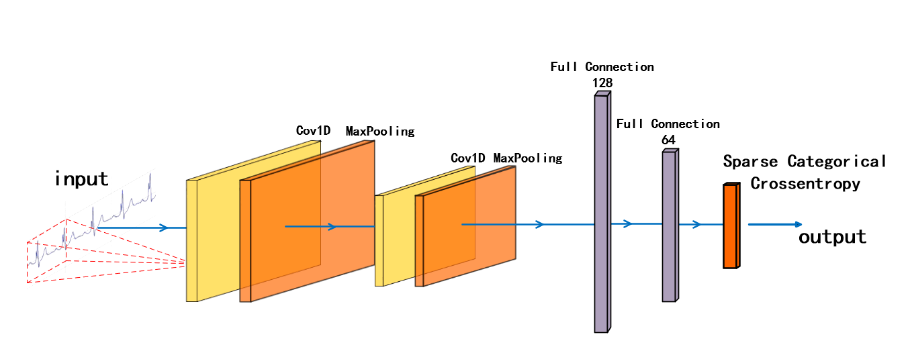
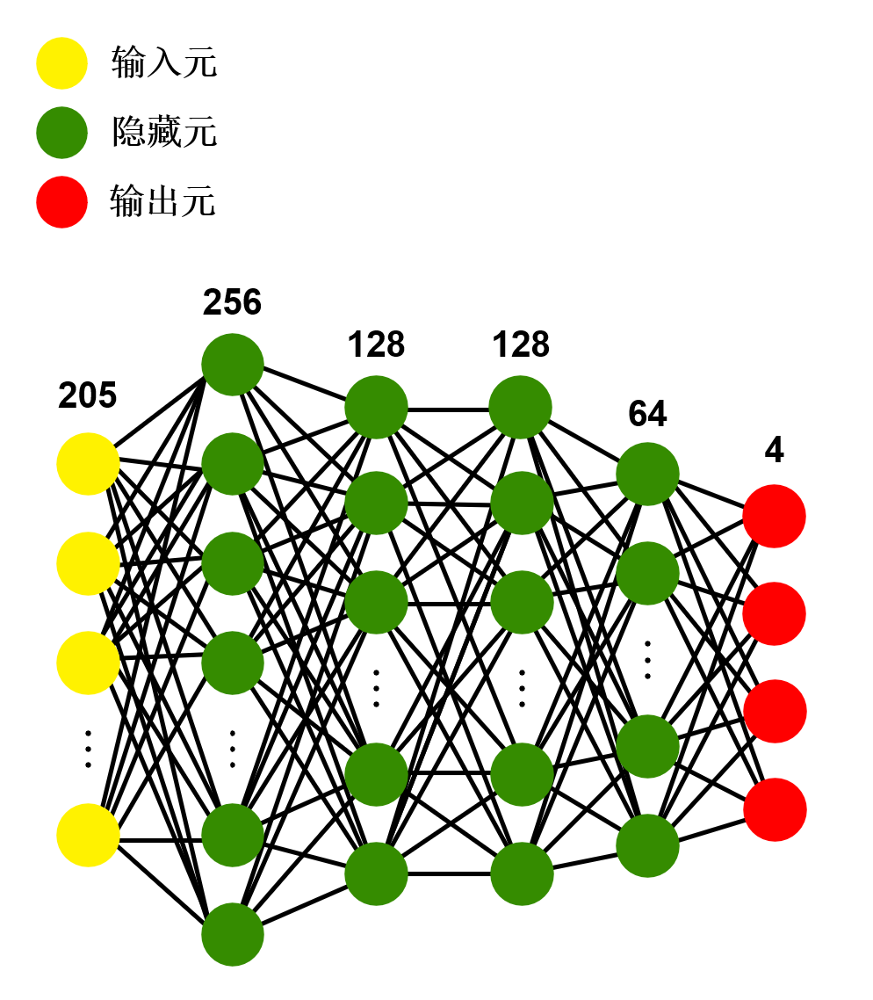
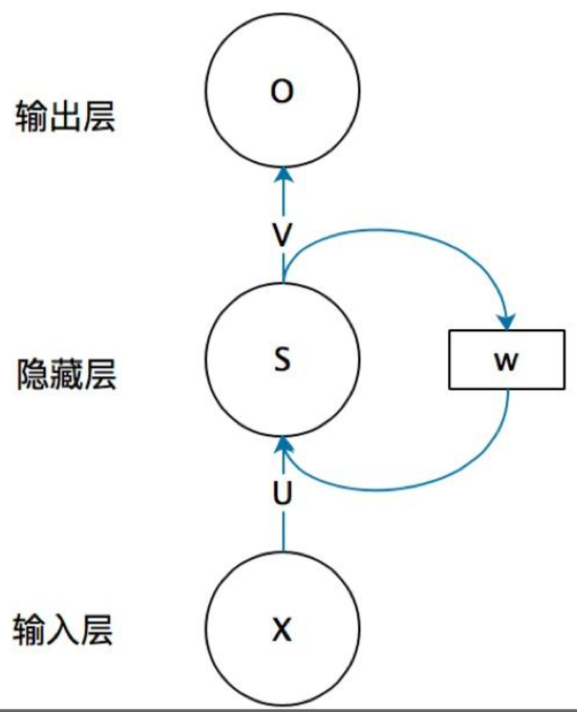

[TOC]


# 基于嵌入式机器学习的心跳分类预测项目代码说明

本项目使用keras框架生成模型,使用数据集来自[天池大赛-心跳信号分类预测](https://tianchi.aliyun.com/competition/entrance/531883/information)，部署至英飞凌的嵌入式平台请参考[我的博客](https://blog.csdn.net/tereaslle/article/details/134439108?spm=1001.2014.3001.5502)

> 环境需求：
>
> python=3.6
>
> keras==2.3.1
>
> tensorflow==2.0.0
>
> 其它包无版本限制

## 必要文件结构

```cmd
│  ablation_study.py
│  bpnn.py
│  cnn.py
│  contrast_study.py
│  plot_dataset.py
│  prepare.py
│  rnn.py
│
├─data
│      prepared.csv
│      prepared10000.csv
│      sample_submit.csv
│      testA.csv
│      train.csv
│
├─pretrained
```


`bpnn.py`为BP神经网络代码

`cnn.py`为卷积神经网络代码，包含2个模型，分别为：四层卷积的网络、LeNet-5

`rnn.py`为循环神经网络代码

`ablation_study.py`用于消融实验

`contrast_study.py`用于对比实验

`prepare.py`用于生成数据集`prepared.csv`文件

`plot_dataset.py`用于绘制四类标签的折线图

`pretrained`文件夹用于存放生成的`.h5`文件，如需修改文件夹名，需要同时修改模型`.py`文件中`savemodel()`方法的静态地址

`data`文件夹存放数据集文件，其中`prepared10000.csv`为10000条训练数据的`.csv`文件，进行真正实验时请,传入`readdata()`方法正确的`data_path`

## 消融实验

为研究不同激活函数与不同隐藏元对神经网络模型性能的影响，我们设计了针对BP神经网络模型的消融实验，各评价标准均为模型运行10次的平均值。

激活函数的实验中我们比较隐藏层全为一种激活函数、混合激活函数的模型性能，控制模型的结构为输入层为205个输入元，第一隐藏层256个隐藏元，第二隐藏层与第三隐藏层128个隐藏元，第四隐藏层64隐藏元，输出层4个隐藏元，并设置输出层激活函数为Softmax，以64个为一组，学习率为0.001的Adam优化器训练100个epoch，结果如下表所示。

| 激活函数选择                 | 训练正确率 | 测试正确率 | 推理时间   | FPR       |
| ---------------------------- | ---------- | ---------- | ---------- | --------- |
| 全部ReLU                     | 99.59%     | 98.70%     | 0.551s     | **1.83%** |
| 全部Sigmoid                  | 99.60%     | 98.59%     | 0.511s     | 2.20%     |
| 全部Tanh                     | 99.30%     | 98.49%     | 0.595s     | 2.31%     |
| 全部Leaky ReLU               | 99.37%     | 98.62%     | 0.606s     | 2.45%     |
| 混合(sigmoid-relu-tanh-tanh) | **99.61%** | **98.72%** | **0.448s** | 2.07%     |

我们还测试了不同隐藏元个数对模型性能的影响，结果如下表所示

| 隐藏元个数 | 训练正确率 | 测试正确率 | 模型大小  | 推理时间   | FPR       |
| ---------- | ---------- | ---------- | --------- | ---------- | --------- |
| 输入元*1   | 99.59%     | 98.68%     | **74296** | **0.528s** | 2.12%     |
| 输入元*2   | **99.63%** | 98.71%     | 200736    | 0.655s     | **1.87%** |
| 输入元*5   | 99.58%     | **98.83%** | 3607384   | 0.872s     | 2.02%     |
| 输入元*10  | 99.59%     | 98.75%     | 超出限制  | 1.396s     | 2.01%     |

## 对比实验

控制实验次数，可修改文件中的全局变量`times`

我们测试了不同模型的训练正确率、测试正确率、模型大小、推理实验与FPR，其中模型大小参考嵌入式开发平台输出的结果，具体对比表现如下表

|              | 训练正确率 | 测试正确率 | 模型大小  | 推理时间   | FPR       |
| ------------ | ---------- | ---------- | --------- | ---------- | --------- |
| 四层卷积网络 | 98.83%     | 98.27%     | 无法部署  | 0.642s     | 2.47%     |
| Lenet-5      | 98.75%     | 98.26%     | **80360** | 0.646s     | 2.77%     |
| BP神经网络   | **99.59%** | **98.70%** | 115624    | 0.551s     | **1.83%** |
| RNN          | 99.32%     | 98.44%     | 无法部署  | **0.524s** | 2.54%     |

在对比实验中用到了4类模型，模型图如下：

四层卷积的网络



LeNet-5



BP神经网络



循环神经网络（图片来自网络）：

